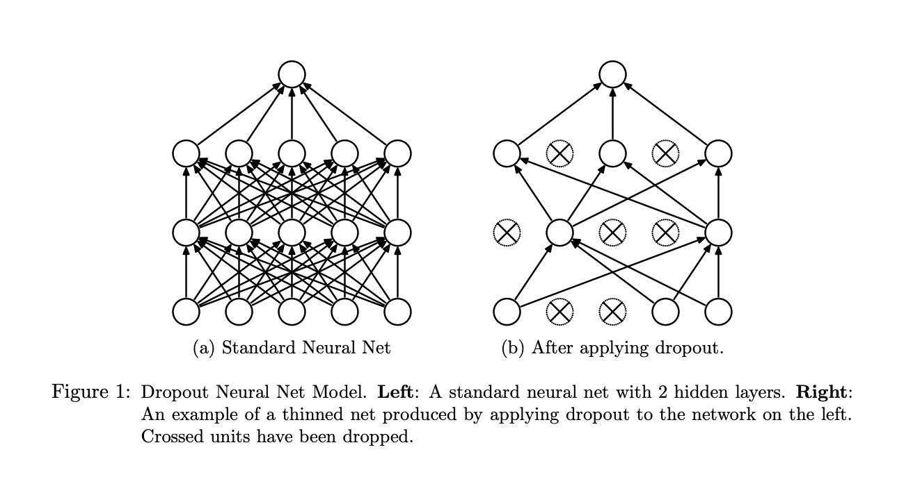

# Tuning Neural Networks with Regularization

## Introduction

Now that you've learned about neural networks and some streamlined methods for building such models, it's time to further explore how to tune and optimize the performance of these networks. One important aspect is reducing the time and resources needed to train these models. In previous lessons, when importing the Santa images, you immediately reduced each image to an extremely pixelated 64x64 representation. On top of that, you further down-sampled the dataset to reduce the number of observations. This was because training neural networks is resource intensive and is often a time consuming process as a result. Typically you also want to improve the accuracy and performance of these models. In this lesson, you will begin to examine various techniques related to these goals, beginning with the discussion of validation sets.

## Objectives

You will be able to: 

- Explain the relationship between bias and variance in neural networks  
- Explain how regularization affects the nodes of a neural network 
- Explain L1, L2, and dropout regularization in a neural network 

## Hyperparameters and iterative deep learning 

First, there are many hyperparameters you can tune. These include: 

- number of hidden units
- number of layers
- learning rate ( $\alpha$ )
- activation function

The question then becomes, how do you choose these parameters? One primary method is to develop validation sets to strike a balance between specificity and generalization. 


## Training, Validation, and Test Sets

When tuning neural networks it typically helps to split the data into three distinct partitions as follows:
- You train algorithms on the training set
- You'll use a validation set to decide which one will be your final model after parameter tuning
- After having chosen the final model (and having evaluated long enough), you'll use the test set to get an unbiased estimate of the classification performance (or whatever your evaluation metric will be)  

Remeber that it is **VERY IMPORTANT** to make sure that the holdout (validation) and test samples come from the same distribution: eg. same resolution of Santa pictures. 

## Bias and Variance in Deep Learning

Finding a balance between generalization and specificity is at the heart of the bias-variance trade off. To further examine this process for tuning neural networks, let's return to a simple example you've seen before. 

### The Circles Example

In classical machine learning, you often need to consider "bias-variance trade-off". You'll investigate these concepts here, and see how deep learning is slightly different and a trade-off isn't always present!

- Bias = underfitting

- High variance = overfitting

- Good fit --> somewhere in between 


To start, take another look at the two circles data, the data looked like this: 


 

Recall that you fit a logistic regression model to the data here. You got something that looked like the picture below. The model didn't do a particularly good job at discriminating between the yellow and purple dots. You could say this is a model with a **high bias**, the model is **underfitting**. 

 

When using a neural network, what you reached in the end was a pretty good decision boundary, a circle discriminating between the yellow and purple dots: 

 

At the other end of the spectrum, you might experience **overfitting**, where you create a circle which is super sensitive to small deviations of the colored dots, like the example below. You can also call this a model with **high variance**. 

  


## The Santa Example 


<tr>
<td>  </td>
<td>  </td>
</tr> 


|       | High variance | High bias   | High variance & bias | Low variance and bias |
|-------|---------------|-------------|----------------------|-----------------------|
|train set error|   12% | 26%         | 26%                  | 12%                  |
|validation set error|   25% | 28%         | 40%                   | 13%                   | 


Assume that our best model can get to a validation set accuracy of 87%. Note that "high" and "low" are relative! Also, in deep learning there is less of a bias variance trade-off! 


## Rules of Thumb Regarding Bias / Variance 


| High Bias? (training performance) | High variance? (validation performance)  |
|---------------|-------------|
| Use a bigger network|    More data     |
| Train longer | Regularization   |
| Look for other existing NN architextures |Look for other existing NN architextures | 


## Regularization

Use regularization when the model overfits to the data. 


### L1 and L2 regularization

#### In logistic regression 

Let's look back at the logistic regression example with lambda, a regularization parameter (another hyperparameter you have to tune).

$$ J (w,b) = \dfrac{1}{m} \sum^m_{i=1}\mathcal{L}(\hat y^{(i)}, y^{(i)})+ \dfrac{\lambda}{2m}||w||_2^2$$

$$||w||_2^2 = \sum^{n_x}_{j=1}w_j^2= w^Tw$$

This is called L2-regularization. You can also add a regularization term for $b$, but $b$ is just one parameter. L2-regularization is the most common type of regularization.

L1-regularization is where you just add a term:

$$ \dfrac{\lambda}{m}||w||_1$$ (could also be 2 in the denominator)


#### In a neural network 

$$ J (w^{[1]},b^{[1]},...,w^{[L]},b^{[L]}) = \dfrac{1}{m} \sum^m_{i=1}\mathcal{L}(\hat y^{(i)}, y^{(i)})+ \dfrac{\lambda}{2m}\sum^L_{l=1}||w^{[l]}||^2$$

$$||w^{[l]}||^2 = \sum^{n^{[l-1]}}_{i=1} \sum^{n^{[l]}}_{j=1} (w_{ij}^{[l]})^2$$

this matrix norm is called the "Frobenius norm", also referred to as $||w^{[l]}||^2 _F$


How does backpropagation change now?
Whichever expression you have from the backpropagation, and add $\dfrac{\lambda}{m} w^{[l]}$.
So,

$$dw^{[l]} = \text{[backpropagation derivatives] }+ $\dfrac{\lambda}{m} w^{[l]}$$ 

Afterwards, $w^{[l]}$ is updated again as $w^{[l]}:= w^{[l]} - \alpha dw^{[l]} $

L2-regularization is called weight decay, because regularization will make your load smaller:

$$w^{[l]}:= w^{[l]} - \alpha \bigr( \text{[backpropagation derivatives] }+ \dfrac{\lambda}{m} w^{[l]}\bigr)$$

$$w^{[l]}:= w^{[l]} - \dfrac{\alpha\lambda}{m}w^{[l]} - \alpha \text{[backpropagation derivatives]}$$

hence your weights will become smaller by a factor $\bigr(1- \dfrac{\alpha\lambda}{m}\bigr)$.

Intuition for regularization: the weight matrices will be penalized from being too large. Actually, the network will be forced to almost be simplified.
Also: e.g., _tanh_ function, if $w$ small, the activation function will be mostly operating in the linear region and not "explode" as easily.

## Dropout Regularization 


When you apply the Dropout technique, a random subset of nodes (also called the units) in a layer are ignored (their weights set to zero) during each phase of training. Below is an image from the [original paper](http://www.jmlr.org/papers/volume15/srivastava14a/srivastava14a.pdf) that introduced this technique. 

On the left you can see a standard neural network with four layers (one input layer, two hidden layers, and an output layer). On the right, you can see the network after Dropout is applied during one step of training. This technique is very effective because it allows us to train neural networks on different parts of the data, thus ensuring that our model is not overly sensitive noise in the data. 


  


In Keras, you specify *Dropout* using the `Dropout` layer, which is applied to input and hidden layers. The `Dropout` layers requires one argument, `rate`, which specifies the fraction of units to drop, usually between 0.2 and 0.5. 

```python
model = models.Sequential()
model.add(layers.Dense(5, activation='relu', input_shape=(500,)))
# Dropout applied to the input layer
model.add(layers.Dropout(0.3))
model.add(layers.Dense(5, activation='relu'))
# Dropout applied to the hidden layer
model.add(layers.Dropout(0.3))
model.add(layers.Dense(1, activation='sigmoid'))
```

In different iterations through the training set, different nodes will be zeroed out!


## Summary

In this lesson you began to explore how to further tune and optimize out of the box neural networks built with Keras. This included regularization analogous to previous machine learning work you've seen, as well dropout regularization, which can be used to further prune your networks. In the upcoming lab you'll get a chance to experiment with these concepts in practice and observe their effect on your models outputs. 
